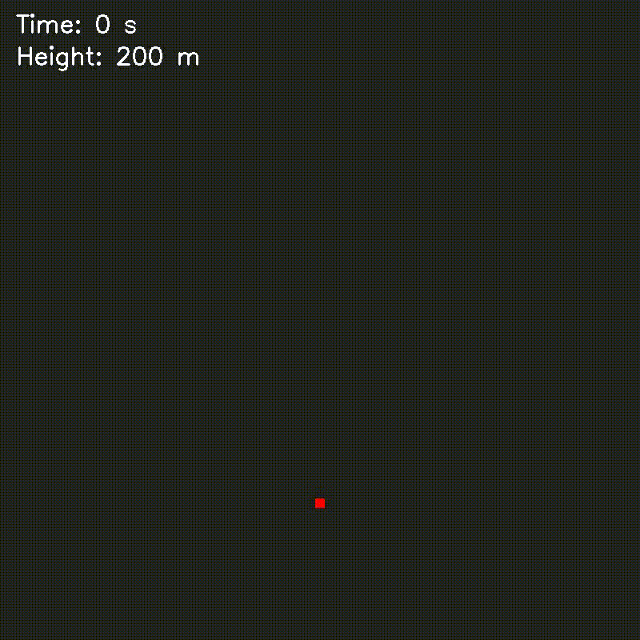

# Radar Submunition Drop Simulation (C++ / OpenCV)

This project is a C++ physics engine built with OpenCV that simulates the descent, footprint tracking, and sensor scattering of a parachute-dropped submunition radar system. 

The simulation was built progressively through 6 distinct cases, starting from basic linear distance-over-time math and culminating in a complex physics model featuring relative ground motion, wind drift, pendulum oscillation, and Gaussian noise generation.

---

## Development Progression & Case Summary

### Case 1: Basic Drop Physics & Frame Logic
* **Core Concept:** Establishing the foundational physics of the parachute drop.
* **Mechanism:** Calculates the radar's altitude over time as it falls from an initial height of 200m at a constant velocity of 13m/s. It uses standard distance/time physics (`distance = velocity * time`) to subtract the fallen distance from the current height every frame.
* **Programming:** Introduces the frame timing logic, calculating the exact decimal fraction of a second between frames (for a 30 FPS video) to ensure the simulation runs at real-world speed.

---

### Case 2: The Radar Footprint & Screen Scaling
* **Core Concept:** Mapping the physical real-world environment onto a digital 2D screen.
* **Mechanism:** Calculates the physical width of the ground the radar can see based on its 25° Field of View (FOV) and current height.
* **Programming:** Introduces the `pixelsPerMeter` conversion ratio. This dynamically scales physical objects (like a 3-meter target) into a specific number of pixels so they can be drawn accurately on an 800x800 digital window. It also calculates the linear shift caused by the radar hanging at a 10° tilt.

---

### Case 3: Radar Rotation & Target Offset
* **Core Concept:** Simulating the mechanical spinning of the radar hardware and observing objects off-center.
* **Mechanism:** Introduces a 3 Revolutions Per Second (RPS) spin. Because the radar is tilted, the rotation causes the footprint to sweep in a wide circle.
* **Programming:** Utilizes 2D rotation matrices (Sine and Cosine math) to visually rotate the geometric target box on its own axis. It also introduces a real-world X/Y offset for the target; as the parachute descends and the FOV footprint shrinks, the offset target organically slides off the edge of the screen.

---

### Case 4: Realistic Radar Scattering (Noise)
* **Core Concept:** Moving from perfect geometry to realistic, messy sensor data.
* **Mechanism:** Replaces the solid geometric target rectangle with a "bright spot" made of scattered data points, mimicking how radar waves bounce and scatter off physical surfaces.
* **Programming:** Utilizes OpenCV's Random Number Generator (`cv::RNG`). It uses a **Gaussian distribution** to cluster thousands of 1-pixel green dots tightly at the exact center of the target, while organically scattering a few dots further out. A **Uniform distribution** is used to slightly randomize the green brightness of every single pixel, creating a textured, glowing noise effect.

---

### Case 5: Multiple Ground Targets
* **Core Concept:** Expanding the simulation from a single object to scanning a complex battlefield map.
* **Mechanism:** Proves that the scaling and rotation math works universally by placing multiple targets of varying sizes at different locations on the ground.
* **Programming:** Upgrades the code structure by introducing a C++ `struct` to define a "Target" (storing its specific X offset, Y offset, and physical size). It uses a `std::vector` list and a `for` loop to independently calculate and draw the noise scatter for every target simultaneously during a single frame.

---

### Case 6: Environmental Physics (Wind Drift & Oscillation)
* **Core Concept:** Simulating the chaotic real-world environment of an unguided parachute drop.
* **Mechanism:** Reverses the perspective—instead of moving the targets, the simulation physically moves the radar "camera" through the sky.
* **Programming:** * Introduces **Wind Drift** by applying a constant velocity to the radar's X and Y coordinates. 
  * Introduces **Pendulum Oscillation** by using a Sine wave to swing the submunition back and forth beneath the parachute. 
  * Uses **Relative Motion** math (subtracting the radar's sky position from the targets' ground positions) to dynamically shift the entire ground map across the screen.

