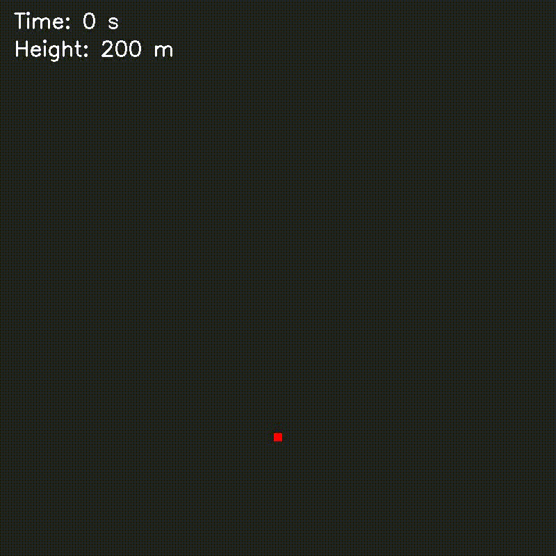

# Radar Submunition Drop Simulation (C++ / OpenCV)

This project is a **C++ physics-based radar simulation engine built using OpenCV**.  
It models the descent of a **parachute-dropped submunition radar system**, simulating radar footprint behavior, sensor scattering, environmental physics, and multiple ground targets.

The simulation evolves through **six progressively complex stages**, starting from basic kinematics and culminating in a dynamic environment with wind drift, pendulum oscillation, and realistic radar noise.

---

# Simulation Demonstrations

<table>
<tr>
<td align="center"><b>Case 1<br>Basic Drop Physics</b></td>
<td align="center"><b>Case 2<br>Radar Footprint & Scaling</b></td>
</tr>
<tr>
<td></td>
<td></td>
</tr>

<tr>
<td align="center"><b>Case 3<br>Radar Rotation & Target Offset</b></td>
<td align="center"><b>Case 4<br>Radar Scattering Noise</b></td>
</tr>
<tr>
<td></td>
<td></td>
</tr>

<tr>
<td align="center"><b>Case 5<br>Multiple Targets</b></td>
<td align="center"><b>Case 6<br>Environmental Physics</b></td>
</tr>
<tr>
<td></td>
<td></td>
</tr>
</table>

---

# Development Progression

## Case 1 – Basic Drop Physics & Frame Logic

**Core Concept:** Establishing the foundational physics of the parachute drop.

The radar starts at **200 meters altitude** and descends at a constant velocity of **13 m/s**.

Distance travelled is calculated using classical kinematics:

```
distance = velocity × time
```

This distance is subtracted from the current altitude each frame.

**Programming Concepts**

- Frame timing synchronization
- Decimal time calculation for **30 FPS**
- Real-time physics update per frame

---

## Case 2 – Radar Footprint & Screen Scaling

**Core Concept:** Mapping real-world radar coverage onto a digital simulation grid.

The radar footprint width on the ground is calculated from:

- Radar height
- **25° field of view (FOV)**

The physical radar footprint expands or shrinks as altitude changes.

**Programming Concepts**

- Pixels-per-meter conversion
- Dynamic scaling between real world and screen
- Rendering targets on an **800×800 simulation window**

---

## Case 3 – Radar Rotation & Target Offset

**Core Concept:** Simulating mechanical radar spin and observing off-center targets.

The radar spins at **3 revolutions per second (RPS)**.

Because the radar is mounted at a **10° tilt**, the radar footprint sweeps across the ground in a circular pattern.

**Programming Concepts**

- 2D rotation matrices
- Trigonometric transforms using

```
sin()
cos()
```

Targets placed with an **X/Y offset** move relative to the radar footprint as the radar descends.

---

## Case 4 – Realistic Radar Scattering (Noise)

**Core Concept:** Moving from perfect geometry to realistic radar sensor data.

Instead of rendering a solid rectangle target, radar returns are represented as **scattered bright points**, simulating radar reflection patterns.

**Programming Concepts**

Random noise is generated using OpenCV's random number generator.

Two statistical distributions are used:

**Gaussian Distribution**

Used to cluster radar reflections near the center of the target.

**Uniform Distribution**

Used to vary brightness of each pixel to simulate signal intensity variation.

This produces a **realistic radar glow effect**.

---

## Case 5 – Multiple Ground Targets

**Core Concept:** Expanding from a single target to scanning multiple objects.

Multiple radar targets with different sizes and positions are placed across the ground map.

**Programming Concepts**

A C++ structure is introduced:

```
struct Target
```

Each target stores:

- X offset
- Y offset
- Physical size

Targets are stored inside:

```
std::vector<Target>
```

A loop processes each target independently during rendering.

---

## Case 6 – Environmental Physics (Wind Drift & Oscillation)

**Core Concept:** Simulating real-world parachute behavior.

Instead of moving targets, the **radar camera itself moves through the environment**.

**Wind Drift**

The radar experiences horizontal velocity due to wind.

**Pendulum Oscillation**

The radar swings beneath the parachute like a pendulum using a sine wave motion.

**Relative Motion System**

Target positions are recalculated relative to the radar's moving position:

```
relative_position = target_position − radar_position
```

This causes the entire ground map to shift dynamically.

---

# Technologies Used

- C++
- OpenCV
- Real-Time Rendering
- Physics Simulation
- Trigonometric Transformations
- Gaussian Noise Modeling

---

## Project Structure

```
radarSimulation
│
├ case1
│   ├ FRAMES/
│   ├ case1.cpp
│   ├ frame_saver.cpp
│   └ output.avi
│
├ case2
│   ├ FRAMES/
│   ├ case2.cpp
│   ├ frame_saver.cpp
│   └ output.avi
│
├ case3
│   ├ FRAMES/
│   ├ case3.cpp
│   ├ frame_saver.cpp
│   └ output.avi
│
├ case4
│   ├ FRAMES/
│   ├ case4.cpp
│   ├ frame_saver.cpp
│   └ output.avi
│
├ case5
│   ├ FRAMES/
│   ├ case5.cpp
│   ├ frame_saver.cpp
│   └ output.avi
│
├ case6
│   ├ FRAMES/
│   ├ case6.cpp
│   ├ frame_saver.cpp
│   └ output.avi
│
├ media/
│   ├ output.gif
│   ├ output (1).gif
│   ├ output (2).gif
│   ├ output (3).gif
│   ├ output (4).gif
│   ├ output (5).gif
│   └ output (6).gif
│
├ README.md
└ .gitignore
```
----

# Future Improvements

Potential extensions for the simulation include:

- Doppler radar velocity modeling
- 3D radar volume visualization
- Terrain elevation modeling
- Radar cross-section based reflections
- Machine learning based target classification

---

# Author

**Sayuj Singh**

SOFTWARE DEVELOPER INTERN
ZEUS NUMERIX PVT LTD, PUNE

Interested in:

- AI / ML
- Computer Vision
- Simulation Systems
- Radar and Signal Processing